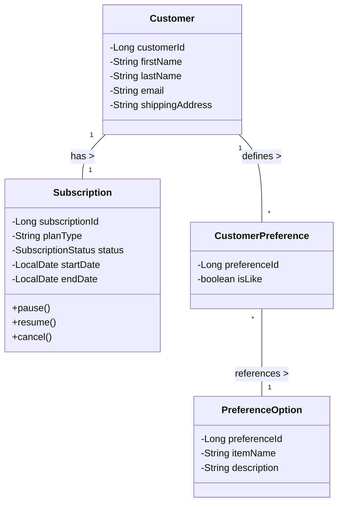
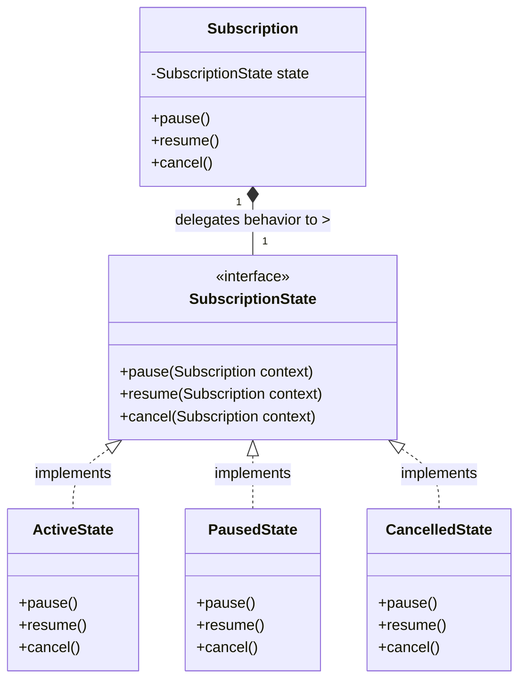
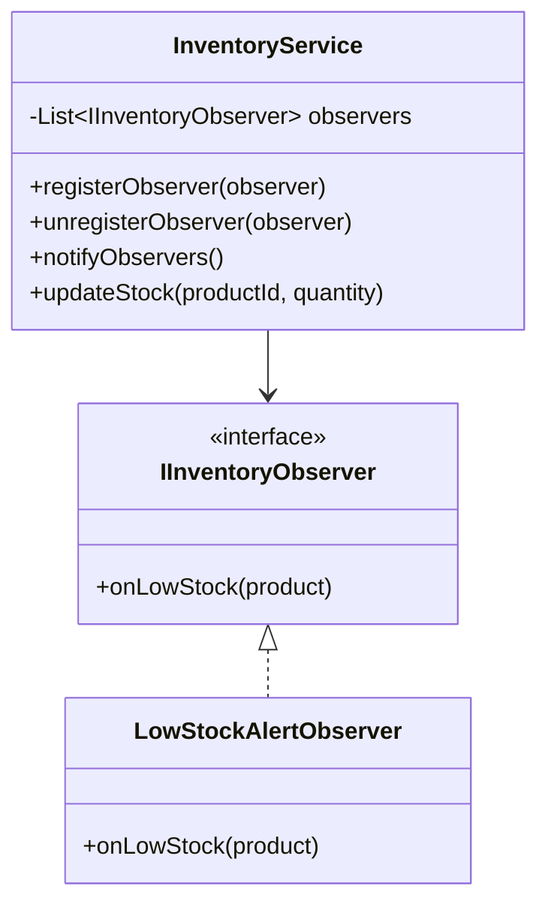
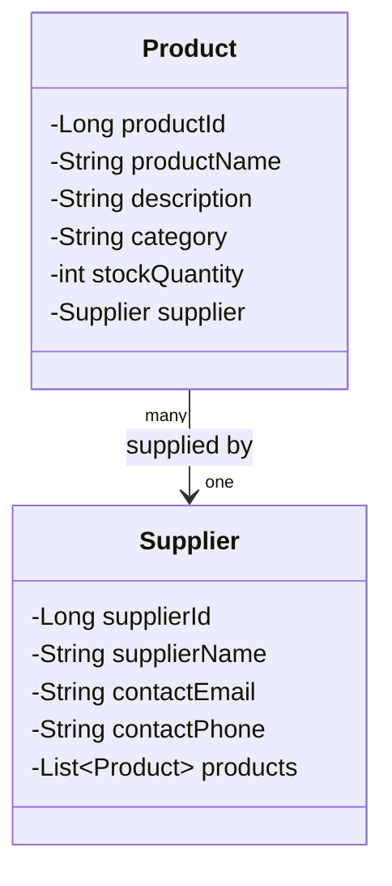

## Individual Contribution 

## Preksha Kamalesh

### Team Member Scope
I was responsible for the complete implementation of the Customer and Subscription management module in CurateBox, specifically:
1. Customer
2. Subscription
3. SubscriptionStatus
4. CustomerPreference
5. PreferenceOption

This ownership was end-to-end (model, repository, service, controller, and UI), satisfying the policy that each student must own complete use cases rather than only frontend/backend parts.

### Use Cases Owned by Me
1. Create New Customer
- Controller: `POST /customers/add`
- UI: Add customer form
- Outcome: Creates a new customer profile and immediately activates their initial Subscription plan.

2. Manage Customer Profile
- API: `PUT /api/customers/{id}`
- UI: Customer edit form
- Outcome: updates first name, last name, email, shipping address

2. Update Preferences
- API: `PUT /api/customers/{id}/preferences`
- UI: Preferences page with like/dislike selection per option
- Outcome: stores customer-specific preference mappings

3. View Subscription Status
- API: `GET /api/customers/{id}/subscription`
- UI: Subscription status page
- Outcome: shows plan type, status, start date, end date

4. Pause / Resume Subscription
- APIs:
  - `PUT /api/subscriptions/{id}/pause`
  - `PUT /api/subscriptions/{id}/resume`
- UI: Action buttons on subscription page
- Outcome: transitions status between ACTIVE and PAUSED

5. Cancel Subscription
- API: `PUT /api/subscriptions/{id}/cancel`
- UI: Action button on subscription page
- Outcome: transitions status to CANCELLED

### Analysis and Design Models (2 Marks)
To directly fulfill the 2 marks for 'Analysis and Design Models', here are the required modeling diagrams for my specific use-cases and the implemented State Pattern.

### Domain Class Diagram

### State Design Pattern Diagram

### Technical Evidence (My Module)

#### Domain Model (Entity Layer)
1. Customer
2. Subscription
3. SubscriptionStatus
4. CustomerPreference
5. PreferenceOption

#### Repository Layer
1. CustomerRepository
2. SubscriptionRepository
3. CustomerPreferenceRepository
4. PreferenceOptionRepository

#### Service Layer (Business Logic)
1. CustomerService
2. SubscriptionService

#### Controller Layer (MVC)
1. CustomerController
2. SubscriptionController
3. ViewController

#### UI (Thymeleaf Views)
1. customers/list
2. customers/edit
3. customers/preferences
4. subscriptions/status

---

## MVC Architecture Justification 

My implementation follows MVC clearly:
1. Model: entities represent persistent business data and relationships.
2. View: Thymeleaf pages render customer/subscription forms and status.
3. Controller: request mapping and response handling are in controllers only.
4. Service: business logic and transactions are encapsulated in services, not in controllers.

This satisfies the "Use of MVC Architecture Pattern" criterion.

---

## Design Pattern + Principle Justification 

### Design Pattern Contribution
**State Design Pattern**: I implemented the State Pattern to accurately and safely manage the lifecycle of a `Subscription`. Instead of using simple status manipulations spread across the `SubscriptionService`, the `Subscription` entity delegates behavior (`pause()`, `resume()`, `cancel()`) to a dedicated `SubscriptionState` interface. Concrete state classes (`ActiveState`, `PausedState`, `CancelledState`) encapsulate the specific logic and transition rules required for each state, ensuring illegal state changes (e.g., attempting to resume a cancelled subscription) are natively prevented.
Supporting files: `Subscription`, `SubscriptionState`, `ActiveState`, `PausedState`, `CancelledState`.

### Design Principle Contribution
I applied SRP (Single Responsibility Principle):
1. Entities only model data and core entity behavior.
2. Repositories only do persistence access.
3. Services only contain business rules and transactions.
4. Controllers only map HTTP requests/responses.

This separation improves maintainability and testability, and aligns with the OOAD policy requirements.

---

## Demo Script 

1. Open dashboard and navigate to Customers page.
2. Click "Add New Customer", fill in the form with a selected plan, and save.
3. Edit the newly created Customer Profile and save.
3. Open Preferences page and update like/dislike options.
4. Open Subscription page and show current status.
5. Click Pause → verify status changes to PAUSED.
6. Click Resume → verify status changes to ACTIVE.
7. Click Cancel → verify status changes to CANCELLED.
8. Show corresponding API calls and responses for the same flow.

---

## Navyashree

### Team Member Scope
I was responsible for the complete implementation of the Product and Inventory Management module in CurateBox, specifically:
1. Product Model
2. Supplier Model
3. InventoryService
4. IInventoryObserver Interface
5. ProductController

This ownership was end-to-end (model, repository, service, controller, and UI), satisfying the policy that each student must own complete use cases rather than only frontend/backend parts.

### Use Cases Owned by Me
1. Manage Products
- API: `GET /api/products` (list all products)
- API: `POST /api/products` (create product)
- API: `PUT /api/products/{id}` (update product)
- API: `DELETE /api/products/{id}` (delete product)
- UI: Products management page with elegant card design
- Outcome: complete CRUD operations for inventory products

2. Update Product Stock
- API: `PUT /api/products/{id}/stock` (update stock quantity)
- UI: Stock update modal with progress bar
- Outcome: adjusts stock and triggers low-stock observer notifications

3. Manage Suppliers
- API: `GET /api/suppliers` (list all suppliers)
- API: `POST /api/suppliers` (create supplier)
- API: `PUT /api/suppliers/{id}` (update supplier with phone)
- API: `DELETE /api/suppliers/{id}` (delete supplier)
- UI: Suppliers management page with statistics
- Outcome: complete CRUD operations for supplier management

4. Low Stock Alerts (Observer Pattern)
- InventoryService: Subject that notifies observers when stock ≤ 10 units
- IInventoryObserver: Interface defining observer contract
- LowStockAlertObserver: Implementation that logs low stock alerts
- Outcome: automatic notifications when products reach critical stock levels

5. Product-Supplier Relationships
- API: Assigning suppliers to products during creation and editing
- Service: Managing ManyToOne relationship between Product and Supplier
- UI: Dropdown and input fields for supplier selection
- Outcome: maintains referential integrity between products and suppliers

### Analysis and Design Models

### Observer Design Pattern Diagram

### Domain Class Diagram

### Technical Evidence (My Module)

#### Domain Model (Entity Layer)
1. Product
2. Supplier

#### Repository Layer
1. ProductRepository
2. SupplierRepository

#### Service Layer (Business Logic)
1. ProductService
2. SupplierService
3. InventoryService (Observer Pattern Implementation)

#### Observer Pattern Components
1. IInventoryObserver (Interface)
2. LowStockAlertObserver (Implementation)

#### Controller Layer (REST API)
1. ProductController
2. SupplierController

#### UI (Thymeleaf Views)
1. inventory/products
2. inventory/suppliers
3. inventory/dashboard

#### DTOs (Data Transfer Objects)
1. ProductDTO
2. SupplierDTO

### MVC Architecture Justification

My implementation follows MVC clearly:
1. **Model**: Entity classes (Product, Supplier) represent persistent business data and relationships. ProductDTO and SupplierDTO serve as data transfer objects between layers.
2. **View**: Thymeleaf templates (products.html, suppliers.html, dashboard.html) render product/supplier management forms, stock updates, and inventory statistics.
3. **Controller**: Request mapping and response handling are strictly in ProductController and SupplierController. REST APIs return JSON responses for CRUD operations.
4. **Service**: Business logic is encapsulated in ProductService, SupplierService, and InventoryService. All transaction management and data processing happens in the service layer, not in controllers.

This satisfies the "Use of MVC Architecture Pattern" criterion by maintaining clear separation between presentation, business logic, and data access layers.

---

## Design Pattern + Principle Justification

### Design Pattern Contribution
**Observer Design Pattern**: I implemented the Observer Pattern to manage inventory notifications and low-stock alerts. InventoryService acts as the **Subject** that maintains a list of observers (IInventoryObserver implementations). When product stock falls below 10 units, InventoryService calls `notifyObservers()` which triggers `onLowStock()` methods on all registered observers. The LowStockAlertObserver implementation logs critical alerts. This design decouples inventory updates from notification logic, allowing multiple observers (email alerts, SMS, dashboard notifications) to be added without modifying core InventoryService code.

Supporting files:
- InventoryService (Subject with observer management)
- IInventoryObserver (Observer interface)
- LowStockAlertObserver (Concrete observer implementation)

### Design Principle Contribution
I applied **SRP (Single Responsibility Principle)**:
1. **Entities** (Product, Supplier) only model data and core business entity behavior.
2. **Repositories** (ProductRepository, SupplierRepository) only handle persistence access and queries.
3. **Services** (ProductService, SupplierService, InventoryService) only contain business rules, transactions, and coordination logic.
4. **Controllers** (ProductController, SupplierController) only map HTTP requests/responses and delegate to services.
5. **Observer Interface** (IInventoryObserver) defines a single responsibility: handling low-stock notifications.

This separation improves maintainability, testability, and extensibility. New features (like email notifications) can be added by creating new observer implementations without touching existing code.

---

## Demo Script

1. Open dashboard and navigate to Products page.
2. Create a new product with supplier assignment and stock quantity.
3. Edit product details including supplier selection and description updates.
4. Open Suppliers page and manage supplier information (name, email, phone).
5. On Products page, open "Update Stock" modal and reduce stock below 10 units.
6. Verify low-stock alert is triggered (check application logs for observer notification).
7. Delete a product and confirm removal from inventory.
8. Show corresponding API calls and JSON responses for all CRUD operations.
9. Verify data persistence by restarting the application and confirming products/suppliers remain.

---

