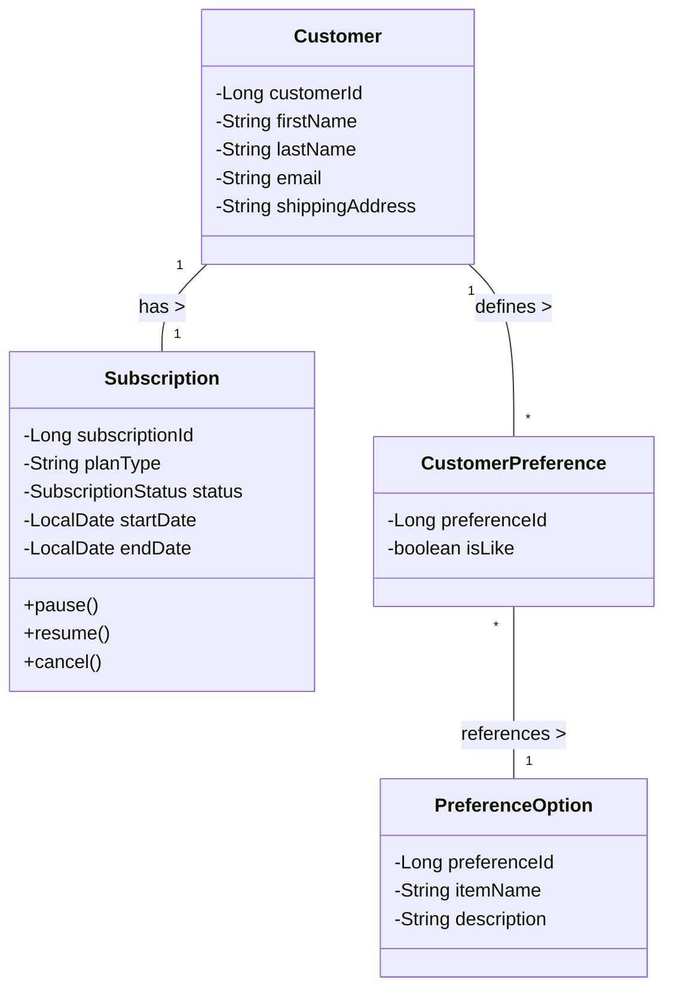
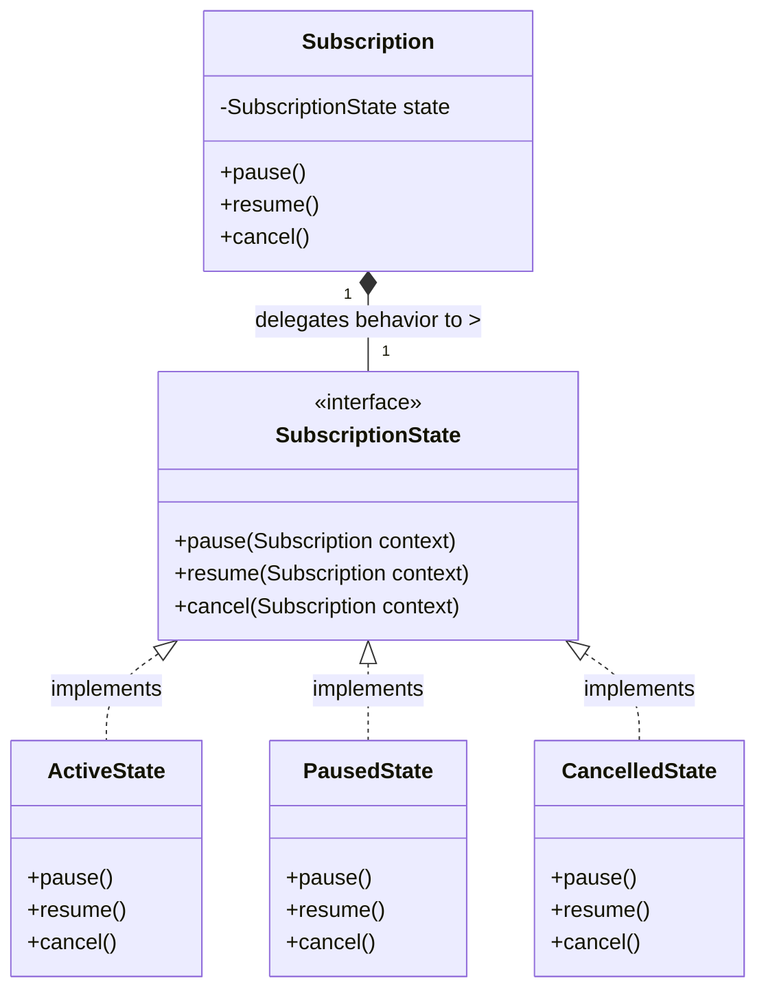

## Individual Contribution 

## Preksha Kamalesh

### Team Member Scope
I was responsible for the complete implementation of the Customer and Subscription management module in CurateBox, specifically:
1. Customer
2. Subscription
3. SubscriptionStatus
4. CustomerPreference
5. PreferenceOption

This ownership was end-to-end (model, repository, service, controller, and UI), satisfying the policy that each student must own complete use cases rather than only frontend/backend parts.

### Use Cases Owned by Me
1. Manage Customer Profile
- API: `PUT /api/customers/{id}`
- UI: Customer edit form
- Outcome: updates first name, last name, email, shipping address

2. Update Preferences
- API: `PUT /api/customers/{id}/preferences`
- UI: Preferences page with like/dislike selection per option
- Outcome: stores customer-specific preference mappings

3. View Subscription Status
- API: `GET /api/customers/{id}/subscription`
- UI: Subscription status page
- Outcome: shows plan type, status, start date, end date

4. Pause / Resume Subscription
- APIs:
  - `PUT /api/subscriptions/{id}/pause`
  - `PUT /api/subscriptions/{id}/resume`
- UI: Action buttons on subscription page
- Outcome: transitions status between ACTIVE and PAUSED

5. Cancel Subscription
- API: `PUT /api/subscriptions/{id}/cancel`
- UI: Action button on subscription page
- Outcome: transitions status to CANCELLED

---

## Analysis and Design Models (2 Marks)
To directly fulfill the 2 marks for 'Analysis and Design Models', here are the required modeling diagrams for my specific use-cases and the implemented State Pattern.

### Domain Class Diagram

### State Design Pattern Diagram

---

## Technical Evidence (My Module)

### Domain Model (Entity Layer)
1. Customer
2. Subscription
3. SubscriptionStatus
4. CustomerPreference
5. PreferenceOption

### Repository Layer
1. CustomerRepository
2. SubscriptionRepository
3. CustomerPreferenceRepository
4. PreferenceOptionRepository

### Service Layer (Business Logic)
1. CustomerService
2. SubscriptionService

### Controller Layer (MVC)
1. CustomerController
2. SubscriptionController
3. ViewController

### UI (Thymeleaf Views)
1. customers/list
2. customers/edit
3. customers/preferences
4. subscriptions/status

---

## MVC Architecture Justification 

My implementation follows MVC clearly:
1. Model: entities represent persistent business data and relationships.
2. View: Thymeleaf pages render customer/subscription forms and status.
3. Controller: request mapping and response handling are in controllers only.
4. Service: business logic and transactions are encapsulated in services, not in controllers.

This satisfies the “Use of MVC Architecture Pattern” criterion.

---

## Design Pattern + Principle Justification 

### Design Pattern Contribution
**State Design Pattern**: I implemented the State Pattern to accurately and safely manage the lifecycle of a `Subscription`. Instead of using simple status manipulations spread across the `SubscriptionService`, the `Subscription` entity delegates behavior (`pause()`, `resume()`, `cancel()`) to a dedicated `SubscriptionState` interface. Concrete state classes (`ActiveState`, `PausedState`, `CancelledState`) encapsulate the specific logic and transition rules required for each state, ensuring illegal state changes (e.g., attempting to resume a cancelled subscription) are natively prevented.
Supporting files: `Subscription`, `SubscriptionState`, `ActiveState`, `PausedState`, `CancelledState`.

### Design Principle Contribution
I applied SRP (Single Responsibility Principle):
1. Entities only model data and core entity behavior.
2. Repositories only do persistence access.
3. Services only contain business rules and transactions.
4. Controllers only map HTTP requests/responses.

This separation improves maintainability and testability, and aligns with the OOAD policy requirements.

---

## Demo Script 

1. Open dashboard and navigate to Customers page.
2. Edit Customer Profile and save.
3. Open Preferences page and update like/dislike options.
4. Open Subscription page and show current status.
5. Click Pause → verify status changes to PAUSED.
6. Click Resume → verify status changes to ACTIVE.
7. Click Cancel → verify status changes to CANCELLED.
8. Show corresponding API calls and responses for the same flow.

---

