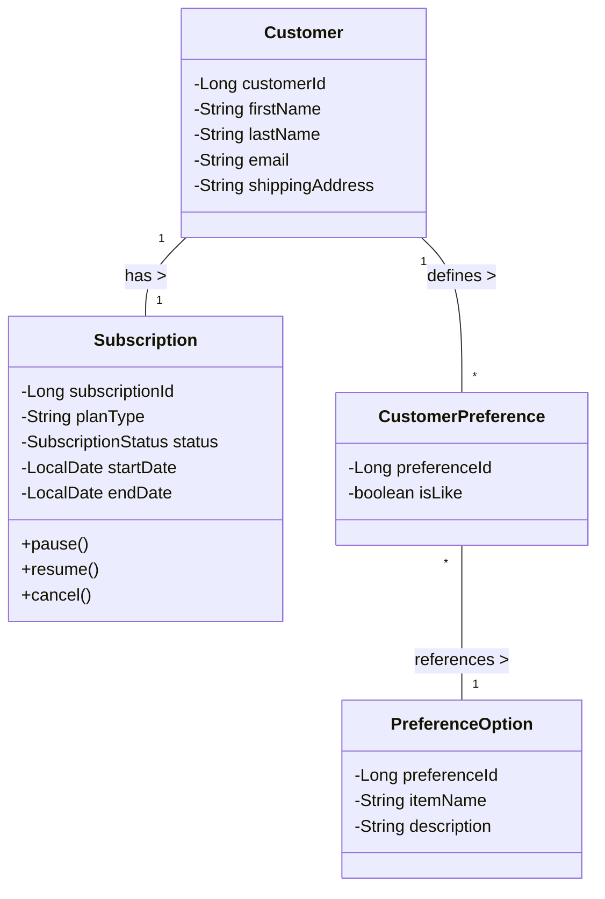
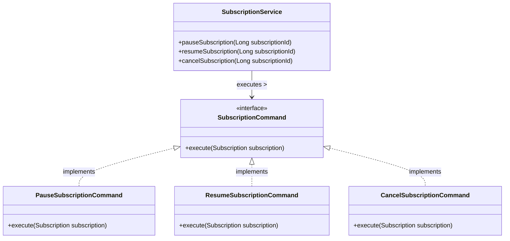
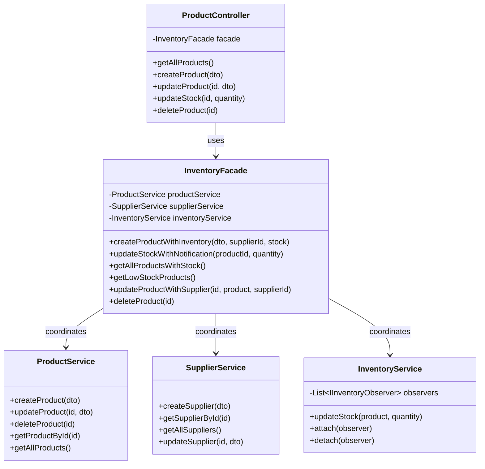
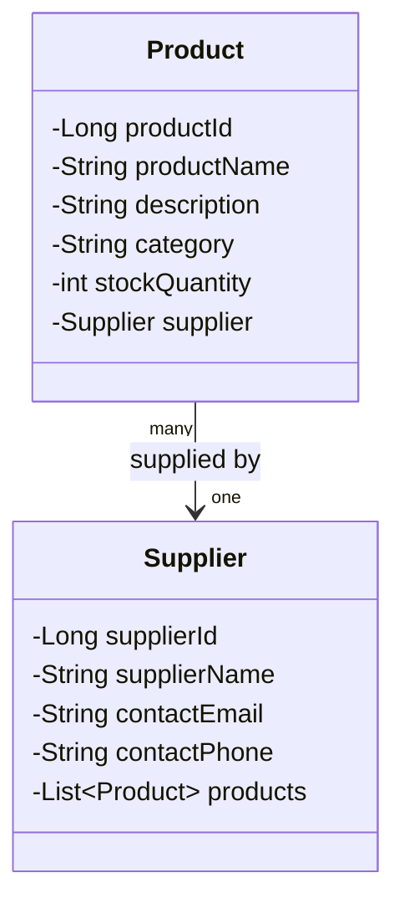
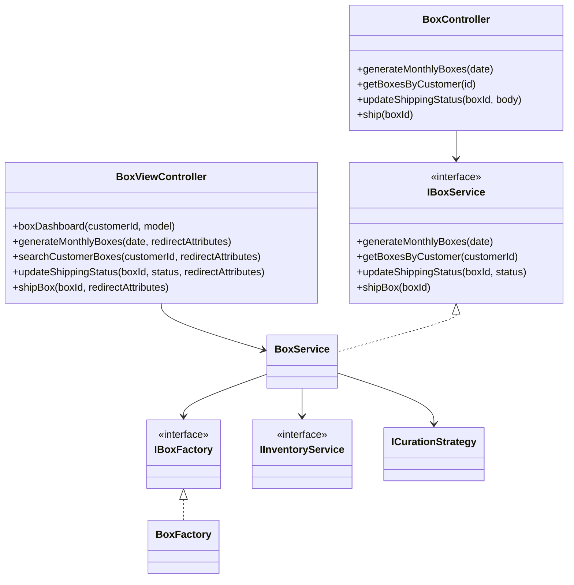
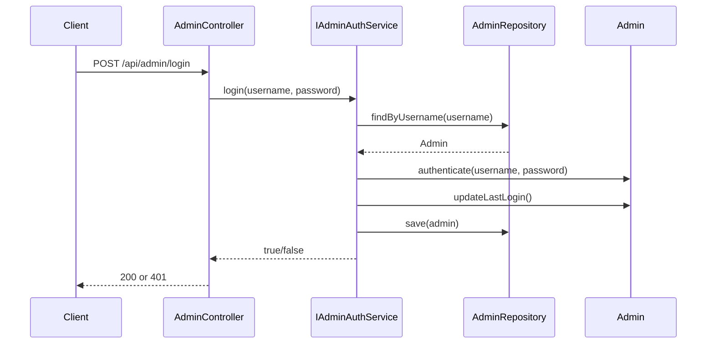
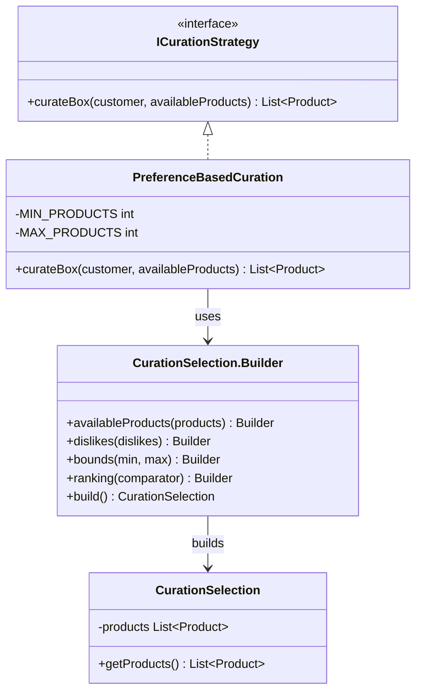
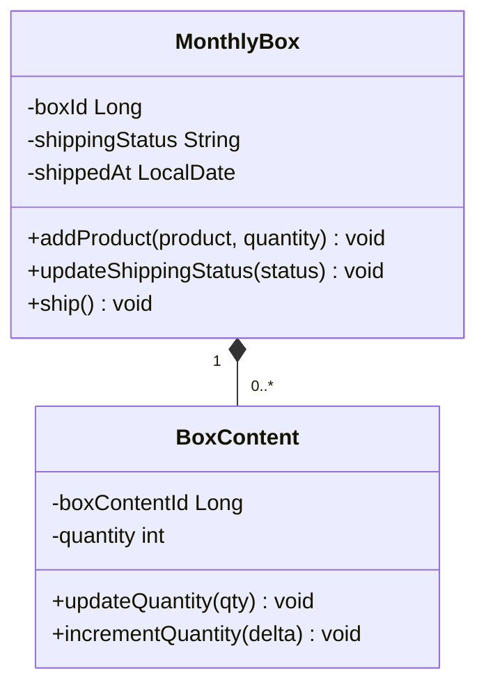

## Individual Contribution 

## Preksha Kamalesh

### Team Member Scope
I was responsible for the complete implementation of the Customer and Subscription management module in CurateBox, specifically:
1. Customer
2. Subscription
3. SubscriptionStatus
4. CustomerPreference
5. PreferenceOption

This ownership was end-to-end (model, repository, service, controller, and UI), satisfying the policy that each student must own complete use cases rather than only frontend/backend parts.

### Use Cases Owned by Me
1. Create New Customer
- Controller: `POST /customers/add`
- UI: Add customer form
- Outcome: Creates a new customer profile and immediately activates their initial Subscription plan.

2. Manage Customer Profile
- API: `PUT /api/customers/{id}`
- UI: Customer edit form
- Outcome: updates first name, last name, email, shipping address

2. Update Preferences
- API: `PUT /api/customers/{id}/preferences`
- UI: Preferences page with like/dislike selection per option
- Outcome: stores customer-specific preference mappings

3. View Subscription Status
- API: `GET /api/customers/{id}/subscription`
- UI: Subscription status page
- Outcome: shows plan type, status, start date, end date

4. Pause / Resume Subscription
- APIs:
  - `PUT /api/subscriptions/{id}/pause`
  - `PUT /api/subscriptions/{id}/resume`
- UI: Action buttons on subscription page
- Outcome: transitions status between ACTIVE and PAUSED

5. Cancel Subscription
- API: `PUT /api/subscriptions/{id}/cancel`
- UI: Action button on subscription page
- Outcome: transitions status to CANCELLED

### Analysis and Design Models (2 Marks)
To directly fulfill the 2 marks for 'Analysis and Design Models', here are the required modeling diagrams for my specific use-cases and the implemented State Pattern.

### Domain Class Diagram

```mermaid
classDiagram
    class Customer {
        -Long customerId
        -String firstName
        -String lastName
        -String email
        -String shippingAddress
    }
    class Subscription {
        -Long subscriptionId
        -String planType
        -SubscriptionStatus status
        -LocalDate startDate
        -LocalDate endDate
        +pause()
        +resume()
        +cancel()
    }
    class CustomerPreference {
        -Long preferenceId
        -boolean isLike
    }
    class PreferenceOption {
        -Long preferenceId
        -String itemName
        -String description
    }
    
    Customer "1" -- "1" Subscription : has >
    Customer "1" -- "*" CustomerPreference : defines >
    CustomerPreference "*" -- "1" PreferenceOption : references >
```

### Design Pattern Diagram

```mermaid
classDiagram
    class SubscriptionCommand {
        <<interface>>
        +execute(Subscription subscription)
    }
    class PauseSubscriptionCommand {
        +execute(Subscription subscription)
    }
    class ResumeSubscriptionCommand {
        +execute(Subscription subscription)
    }
    class CancelSubscriptionCommand {
        +execute(Subscription subscription)
    }
    class SubscriptionService {
        +pauseSubscription(Long subscriptionId)
        +resumeSubscription(Long subscriptionId)
        +cancelSubscription(Long subscriptionId)
    }
    
    SubscriptionCommand <|.. PauseSubscriptionCommand : implements
    SubscriptionCommand <|.. ResumeSubscriptionCommand : implements
    SubscriptionCommand <|.. CancelSubscriptionCommand : implements
    SubscriptionService --> SubscriptionCommand : executes >
```

### Technical Evidence (My Module)

#### Domain Model (Entity Layer)
1. Customer
2. Subscription
3. SubscriptionStatus
4. CustomerPreference
5. PreferenceOption

#### Repository Layer
1. CustomerRepository
2. SubscriptionRepository
3. CustomerPreferenceRepository
4. PreferenceOptionRepository

#### Service Layer (Business Logic)
1. CustomerService
2. SubscriptionService

#### Controller Layer (MVC)
1. CustomerController
2. SubscriptionController
3. ViewController

#### UI (Thymeleaf Views)
1. customers/list
2. customers/edit
3. customers/preferences
4. subscriptions/status

---

## MVC Architecture Justification 

My implementation follows MVC clearly:
1. Model: entities represent persistent business data and relationships.
2. View: Thymeleaf pages render customer/subscription forms and status.
3. Controller: request mapping and response handling are in controllers only.
4. Service: business logic and transactions are encapsulated in services, not in controllers.

This satisfies the "Use of MVC Architecture Pattern" criterion.

---

## Design Pattern + Principle Justification 

### Design Pattern Contribution
**Command Design Pattern**: I implemented the Command Pattern to accurately and safely manage the lifecycle actions of a `Subscription`. Instead of embedding complex state transition validation inside the `Subscription` entity or scattering it across the service, the `SubscriptionService` executes standalone `SubscriptionCommand` objects (`PauseSubscriptionCommand`, `ResumeSubscriptionCommand`, `CancelSubscriptionCommand`). These commands encapsulate the specific logic and validation rules required for each action, ensuring illegal state changes (e.g., attempting to resume a cancelled subscription) are safely prevented while keeping the entity acting as a pure data model.
Supporting files: `SubscriptionCommand`, `PauseSubscriptionCommand`, `ResumeSubscriptionCommand`, `CancelSubscriptionCommand`.

### Design Principle Contribution
I applied SRP (Single Responsibility Principle):
1. Entities only model data and core entity behavior.
2. Repositories only do persistence access.
3. Services only contain business rules and transactions.
4. Controllers only map HTTP requests/responses.

This separation improves maintainability and testability, and aligns with the OOAD policy requirements.

---

## Demo Script 

1. Open dashboard and navigate to Customers page.
2. Click "Add New Customer", fill in the form with a selected plan, and save.
3. Edit the newly created Customer Profile and save.
3. Open Preferences page and update like/dislike options.
4. Open Subscription page and show current status.
5. Click Pause → verify status changes to PAUSED.
6. Click Resume → verify status changes to ACTIVE.
7. Click Cancel → verify status changes to CANCELLED.
8. Show corresponding API calls and responses for the same flow.

---

## Navyashree

### Team Member Scope
I was responsible for the complete implementation of the Product and Inventory Management module in CurateBox, specifically:
1. Product Model
2. Supplier Model
3. InventoryService
4. IInventoryObserver Interface
5. ProductController

This ownership was end-to-end (model, repository, service, controller, and UI), satisfying the policy that each student must own complete use cases rather than only frontend/backend parts.

### Use Cases Owned by Me
1. Manage Products
- API: `GET /api/products` (list all products)
- API: `POST /api/products` (create product)
- API: `PUT /api/products/{id}` (update product)
- API: `DELETE /api/products/{id}` (delete product)
- UI: Products management page with elegant card design
- Outcome: complete CRUD operations for inventory products

2. Update Product Stock
- API: `PUT /api/products/{id}/stock` (update stock quantity)
- UI: Stock update modal with progress bar
- Outcome: adjusts stock and triggers low-stock observer notifications

3. Manage Suppliers
- API: `GET /api/suppliers` (list all suppliers)
- API: `POST /api/suppliers` (create supplier)
- API: `PUT /api/suppliers/{id}` (update supplier with phone)
- API: `DELETE /api/suppliers/{id}` (delete supplier)
- UI: Suppliers management page with statistics
- Outcome: complete CRUD operations for supplier management

4. Low Stock Management
- Facade Method: `getLowStockProducts()` retrieves products with stock ≤ 10 units
- Service: InventoryService provides `isLowStock()` check
- Alerts: Logged directly when stock falls below threshold
- Outcome: Automatic low-stock tracking through Facade interface

5. Product-Supplier Relationships
- API: Assigning suppliers to products during creation and editing
- Service: Managing ManyToOne relationship between Product and Supplier via Facade
- UI: Dropdown and input fields for supplier selection
- Outcome: maintains referential integrity between products and suppliers

### Analysis and Design Models

### Facade Design Pattern Diagram

```mermaid
classDiagram
    class ProductController {
        -InventoryFacade facade
        +getAllProducts()
        +createProduct(dto)
        +updateProduct(id, dto)
        +updateStock(id, quantity)
        +deleteProduct(id)
    }
    class InventoryFacade {
        -ProductService productService
        -SupplierService supplierService
        -InventoryService inventoryService
        +createProductWithInventory(dto, supplierId, stock)
        +updateStockWithNotification(productId, quantity)
        +getAllProductsWithStock()
        +getLowStockProducts()
        +updateProductWithSupplier(id, product, supplierId)
        +deleteProduct(id)
    }
    class ProductService {
        +createProduct(dto)
        +updateProduct(id, dto)
        +deleteProduct(id)
        +getProductById(id)
        +getAllProducts()
    }
    class SupplierService {
        +createSupplier(dto)
        +getSupplierById(id)
        +getAllSuppliers()
        +updateSupplier(id, dto)
    }
    class InventoryService {
        -List~IInventoryObserver~ observers
        +updateStock(product, quantity)
        +attach(observer)
        +detach(observer)
    }
    
    ProductController --> InventoryFacade : uses
    InventoryFacade --> ProductService : coordinates
    InventoryFacade --> SupplierService : coordinates
    InventoryFacade --> InventoryService : coordinates
```

### Domain Class Diagram

```mermaid
classDiagram
    class Product {
        -Long productId
        -String productName
        -String description
        -String category
        -int stockQuantity
        -Supplier supplier
    }
    class Supplier {
        -Long supplierId
        -String supplierName
        -String contactEmail
        -String contactPhone
        -List~Product~ products
    }
    
    Product "many" --> "one" Supplier : supplied by
```

### Technical Evidence (My Module)

#### Domain Model (Entity Layer)
1. Product
2. Supplier

#### Repository Layer
1. ProductRepository
2. SupplierRepository

#### Service Layer (Business Logic)
1. ProductService
2. SupplierService
3. InventoryService (Subsystem: Stock management & low-stock checks)
4. **InventoryFacade** (Main Pattern: Unified interface coordinating all services)

#### Facade Components
1. InventoryFacade (Provides simplified interface to complex subsystems)
2. Coordinated Services: ProductService, SupplierService, InventoryService

#### Controller Layer (REST API)
1. ProductController (Uses InventoryFacade)
2. SupplierController

#### UI (Thymeleaf Views)
1. inventory/products
2. inventory/suppliers
3. inventory/dashboard

#### DTOs (Data Transfer Objects)
1. ProductDTO
2. SupplierDTO

### MVC Architecture Justification

My implementation follows MVC clearly:
1. **Model**: Entity classes (Product, Supplier) represent persistent business data and relationships. ProductDTO and SupplierDTO serve as data transfer objects between layers.
2. **View**: Thymeleaf templates (products.html, suppliers.html, dashboard.html) render product/supplier management forms, stock updates, and inventory statistics.
3. **Controller**: Request mapping and response handling are strictly in ProductController and SupplierController. REST APIs return JSON responses for CRUD operations.
4. **Service**: Business logic is encapsulated in ProductService, SupplierService, and InventoryService. All transaction management and data processing happens in the service layer, not in controllers.

This satisfies the "Use of MVC Architecture Pattern" criterion by maintaining clear separation between presentation, business logic, and data access layers.

---

## Design Pattern + Principle Justification

### Design Pattern Contribution
**Facade Design Pattern**: I implemented the Facade Pattern to provide a unified, simplified interface for the complex inventory management system. Instead of exposing clients (Product UI, Admin dashboard) directly to multiple services (ProductService, SupplierService, InventoryService), the `InventoryFacade` acts as a single entry point that:

1. **Encapsulates complexity** - Hides the interaction between ProductService, SupplierService, and InventoryService
2. **Provides simplified API** - Clients call simple methods like `createProductWithInventory()`, `updateStockWithNotification()` instead of coordinating multiple services
3. **Manages stock tracking** - Internally coordinates with InventoryService to check low-stock conditions
4. **Hides internal communication** - ProductController only knows about InventoryFacade, not the underlying services

**Participants:**
- **Facade** (InventoryFacade): Provides unified interface
- **Subsystems** (ProductService, SupplierService, InventoryService): Complex internal logic
- **Client** (ProductController): Uses only the Facade

**Example of Facade in action:**
```java
// Without Facade (complex - multiple calls)
productService.createProduct(dto);
supplierService.assignToProduct(productId, supplierId);
inventoryService.updateStock(product, initialQuantity);

// With Facade (simple - single unified call)
inventoryFacade.createProductWithInventory(dto, supplierId, initialQuantity);
```

This pattern improves maintainability by keeping the controller simple and clean, while allowing internal refactoring of services without affecting client code.

Supporting files:
- InventoryFacade (Facade providing unified interface)
- ProductService, SupplierService, InventoryService (Hidden subsystems)
- ProductController (Client using only Facade)

### Design Principle Contribution
I applied **OCP (Open/Closed Principle)**:

The inventory management system is **open for extension, closed for modification**:

1. **Core Facade** (InventoryFacade) remains **closed for modification** - It provides a stable interface for inventory operations and coordinates internal subsystems.

2. **Subsystem Interface** - Internal services (ProductService, SupplierService, InventoryService) are hidden behind the Facade, providing a contract for their responsibilities.

3. **Extensibility**: New features and services can be added by:
   - Creating new service implementations (e.g., audit logging service, notification service)
   - Adding them to the Facade without modifying existing subsystems
   - Extending Facade methods without breaking existing client code (ProductController)

**Example of OCP in action:**
```
// New feature: Audit logging service
class AuditService {
    public void logProductCreation(Product product) { ... }
}

// Add to Facade without modifying ProductController
public class InventoryFacade {
    private AuditService auditService;
    
    public Product createProductWithInventory(...) {
        Product product = productService.createProduct(dto);
        auditService.logProductCreation(product); // New feature added
        return product;
    }
}
```

The system remains stable while new subsystem features can be seamlessly added, demonstrating the Open/Closed Principle. This design ensures backward compatibility and allows the codebase to evolve without breaking existing functionality.

---

## Demo Script

1. Open dashboard and navigate to Products page.
2. Create a new product with supplier assignment and stock quantity.
3. Edit product details including supplier selection and description updates.
4. Open Suppliers page and manage supplier information (name, email, phone).
5. On Products page, open "Update Stock" modal and reduce stock below 10 units.
6. Verify low-stock alert is triggered (check application logs for observer notification).
7. Delete a product and confirm removal from inventory.
8. Show corresponding API calls and JSON responses for all CRUD operations.
9. Verify data persistence by restarting the application and confirming products/suppliers remain.

---

## Nidhi K

### Team Member Scope
I was responsible for the complete implementation and refinement of the Admin + Box Management module in CurateBox, specifically:
1. Admin
2. AdminController
3. BoxService
4. BoxFactory
5. BoxController
6. BoxViewController

This ownership was end-to-end (model, controller, service, factory integration, and API behavior) and aligned with the policy that each student owns full use cases.

### Use Cases Owned by Me
1. Admin Login
- API: `POST /api/admin/login`
- Outcome: validates credentials, updates last login time, returns clean success/error response.

2. Box Management Webpage
- UI: `GET /boxes/dashboard`
- Outcome: provides a dedicated page for generating boxes, searching customer boxes, and updating shipping.

3. Generate Monthly Boxes
- API: `POST /api/boxes/generate?date=yyyy-MM-dd`
- UI: `POST /boxes/dashboard/generate`
- Outcome: generates curated boxes for active subscribers for the requested date.

4. View Customer Boxes
- API: `GET /api/boxes/customer/{id}`
- UI: `POST /boxes/dashboard/search`
- Outcome: returns all monthly boxes for the selected customer.

5. Update Box Shipping Status
- API: `PUT /api/boxes/{boxId}/status`
- UI: `POST /boxes/dashboard/status`
- Outcome: validates and updates shipping status using service-layer rules.

6. Mark Box as Shipped
- API: `PUT /api/boxes/{boxId}/ship`
- UI: `POST /boxes/dashboard/ship`
- Outcome: marks shipment as shipped and records shipping date.

### Analysis and Design Models

#### Module Class Diagram

```mermaid
classDiagram
    class BoxController {
        +generateMonthlyBoxes(date)
        +getBoxesByCustomer(id)
        +updateShippingStatus(boxId, body)
        +ship(boxId)
    }

    class BoxViewController {
        +boxDashboard(customerId, model)
        +generateMonthlyBoxes(date, redirectAttributes)
        +searchCustomerBoxes(customerId, redirectAttributes)
        +updateShippingStatus(boxId, status, redirectAttributes)
        +shipBox(boxId, redirectAttributes)
    }

    class IBoxService {
        <<interface>>
        +generateMonthlyBoxes(date)
        +getBoxesByCustomer(customerId)
        +updateShippingStatus(boxId, status)
        +shipBox(boxId)
    }

    class BoxService
    class IBoxFactory {
        <<interface>>
    }
    class BoxFactory
    class IInventoryService {
        <<interface>>
    }

    BoxController --> IBoxService
    BoxViewController --> BoxService
    IBoxService <|.. BoxService
    BoxService --> IBoxFactory
    IBoxFactory <|.. BoxFactory
    BoxService --> IInventoryService
    BoxService --> ICurationStrategy
```

#### Admin Login Sequence Diagram

```mermaid
sequenceDiagram
    participant Client
    participant AdminController
    participant IAdminAuthService
    participant AdminRepository
    participant Admin

    Client->>AdminController: POST /api/admin/login
    AdminController->>IAdminAuthService: login(username, password)
    IAdminAuthService->>AdminRepository: findByUsername(username)
    AdminRepository-->>IAdminAuthService: Admin
    IAdminAuthService->>Admin: authenticate(username, password)
    IAdminAuthService->>Admin: updateLastLogin()
    IAdminAuthService->>AdminRepository: save(admin)
    IAdminAuthService-->>AdminController: true/false
    AdminController-->>Client: 200 or 401
```

### MVC Architecture Justification
My module follows MVC clearly:
1. **Controller**: `AdminController`, `BoxController`, and `BoxViewController` only handle request/response and validation.
2. **Service**: `BoxService`, `AdminAuthService` contain business rules.
3. **Repository**: data access is isolated to repository interfaces and consumed by services.
4. **Model**: `Admin`, `MonthlyBox`, `BoxContent`, and related entities hold domain state/behavior.

### Design Pattern + Principle Justification

#### Design Pattern Contribution
**Factory Pattern**: `BoxFactory` centralizes object creation of `MonthlyBox` and `BoxContent`, while `BoxService` consumes the factory abstraction (`IBoxFactory`) instead of constructing entities directly. The box page and API both use the same service, so the workflow stays consistent.

Supporting files:
- `BoxFactory`
- `IBoxFactory`
- `BoxService`
- `BoxViewController`

**Strategy Pattern**: `ICurationStrategy` and `PreferenceBasedCuration` decide which products go into a box based on customer preferences. `BoxService` keeps the strategy as a dependency and can switch it with `setCurationStrategy(...)`.

Supporting files:
- `ICurationStrategy`
- `PreferenceBasedCuration`
- `BoxService`

#### Design Principle Contribution
**DIP (Dependency Inversion Principle)**:
1. `BoxController` depends on `IBoxService`.
2. `AdminController` depends on `IAdminAuthService`.
3. `BoxService` depends on abstractions `IBoxFactory`, `IInventoryService`, and `ICurationStrategy`.
4. `BoxViewController` reuses `BoxService` instead of creating box logic itself.

High-level modules now depend on interfaces, while low-level implementations are injected by Spring.

### Demo Script
1. Open `/admin/login` and sign in with the seeded admin account.
2. Open `/boxes/dashboard` and show the dedicated Box Management page.
3. Generate monthly boxes by selecting a date.
4. Search customer boxes by customer ID and show the generated result table.
5. Update shipping status and mark a box as shipped.
6. Mention that the same workflow is also available through `/api/boxes/**` endpoints.

---

## Navya (PES2UG23CS372)

### Team Member Scope
I was responsible for implementation and refinement of the curation + box content behavior module in CurateBox, specifically:
1. `ICurationStrategy`
2. `PreferenceBasedCuration`
3. `MonthlyBox`
4. `BoxContent`
5. Curation preview flow in Box APIs and Box UI

This ownership is end-to-end for the assigned classes and includes model behavior, service integration, API exposure, and UI updates.

### Use Cases Owned by Me
1. Preview Curated Products for a Customer
- API: `GET /api/boxes/customer/{id}/preview`
- UI: `POST /boxes/dashboard/preview` on Box Management page
- Outcome: previews products selected by curation logic without changing inventory or creating a box.

2. Preference-Based Curation Pipeline Execution
- Service flow: `BoxService.previewCuration(...)` and `BoxService.generateMonthlyBoxes(...)`
- Outcome: shared curation pipeline consistently handles input checks, filtering disliked categories, ranking liked categories first, and enforcing min/max box size.

3. Box Content Domain Safety
- Model: `BoxContent.updateQuantity(...)`, `BoxContent.incrementQuantity(...)`
- Outcome: prevents invalid (non-positive) quantities from entering the domain model.

4. Monthly Box Product Merge + Shipping Normalization
- Model: `MonthlyBox.addProduct(...)`, `MonthlyBox.updateShippingStatus(...)`
- Outcome:
  - prevents null products and invalid quantities
  - merges duplicate products by increasing quantity
  - normalizes status values and auto-sets `shippedAt` when status becomes `SHIPPED`.

### Analysis and Design Models

#### Curation Builder Pattern Diagram

```mermaid
classDiagram
    class ICurationStrategy {
        <<interface>>
        +curateBox(customer, availableProducts) List~Product~
    }

    class PreferenceBasedCuration {
        -MIN_PRODUCTS int
        -MAX_PRODUCTS int
        +curateBox(customer, availableProducts) List~Product~
    }

    class CurationSelection {
        -products List~Product~
        +getProducts() List~Product~
    }

    class CurationSelection.Builder {
        +availableProducts(products) Builder
        +dislikes(dislikes) Builder
        +bounds(min, max) Builder
        +ranking(comparator) Builder
        +build() CurationSelection
    }

    ICurationStrategy <|.. PreferenceBasedCuration
    PreferenceBasedCuration --> CurationSelection.Builder : uses
    CurationSelection.Builder --> CurationSelection : builds
```

#### Monthly Box and Box Content Diagram

```mermaid
classDiagram
    class MonthlyBox {
        -boxId Long
        -shippingStatus String
        -shippedAt LocalDate
        +addProduct(product, quantity) void
        +updateShippingStatus(status) void
        +ship() void
    }

    class BoxContent {
        -boxContentId Long
        -quantity int
        +updateQuantity(qty) void
        +incrementQuantity(delta) void
    }

    MonthlyBox "1" *-- "0..*" BoxContent
```

### GRASP + Design Pattern Justification

#### GRASP Principle Used: Information Expert
I applied **Information Expert** by placing core responsibility in the classes that hold the required data:
1. `MonthlyBox` owns box-content aggregation and shipping-status normalization because it has `boxContents`, `shippingStatus`, and `shippedAt`.
2. `BoxContent` owns quantity validation because it directly stores `quantity`.
3. `CurationSelection.Builder` owns curation selection assembly (filtering, ranking, bounds) because it directly receives the required construction inputs.

This keeps behavior close to data and avoids scattering domain rules into controllers.

#### Design Pattern Used: Builder Pattern
I implemented **Builder** using `CurationSelection.Builder`:
1. Curation assembly is built step-by-step with fluent methods:
    - set available products
    - set dislikes
    - set min/max bounds
    - set ranking comparator
2. `build()` performs filtering, ranking, and size-bound enforcement in one place and returns `CurationSelection`.
3. `PreferenceBasedCuration` remains focused on extracting preferences and defining ranking, while object assembly logic stays in the builder.

This pattern is different from the already used patterns (Factory, Facade, Command, Strategy) and keeps curation construction extensible.

### Technical Evidence (My Module)

#### Model Layer
1. `MonthlyBox`
2. `BoxContent`

#### Service Strategy Layer
1. `ICurationStrategy`
2. `PreferenceBasedCuration`

#### Service Builder Layer
3. `CurationSelection`
4. `CurationSelection.Builder`

#### Service / Controller Integration
1. `IBoxService.previewCuration(...)`
2. `BoxService.previewCuration(...)`
3. `BoxController` preview endpoint
4. `BoxViewController` preview flow

#### UI (Thymeleaf)
1. `boxes/dashboard` (added Curation Preview section)

### Demo Script
1. Open `/admin/login` and sign in.
2. Open `/boxes/dashboard`.
3. In **Curation Preview**, enter customer ID and click **Preview Products**.
4. Verify previewed products prioritize liked categories and exclude disliked categories.
5. Generate monthly boxes for a date and verify generation still works.
6. Search customer boxes and confirm contents are created.
7. Update status / ship box and verify `SHIPPED` status behavior remains correct.

---

